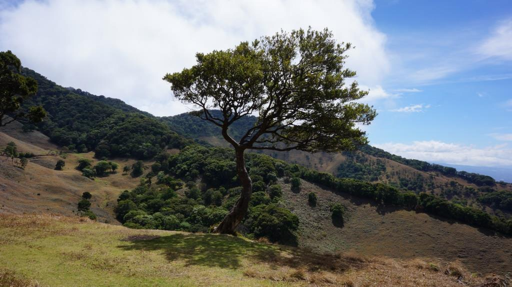

<h1>Conexión de parches boscosos en la Zona Protectora El Chayote (ZPEC)</h1>

## Área de estudio:

La <em>Zona Protectora El Chayote</em> se sitúa en la provincia de Alajuela, Costa Rica, entre dos áreas silvestres destacadas: el Parque Nacional del Agua Juan Castro Blanco y el Parque Nacional Volcán Poás. Esta zona abarca 841 hectáreas, ubicadas entre los cantones de Zarcero y Naranjo. Dentro de la Zona Protectora El Chayote, se encuentra la finca La Chiripa, que se extiende por 163 hectáreas. La Chiripa es una zona montañosa que actúa como área de infiltración de aguas y representa el 20% de la Zona Protectora El Chayote. Para los habitantes de Naranjo, esta finca es de gran importancia debido a su riqueza biológica e hídrica. <a href="https://es.wikipedia.org/wiki/Zona_protectora_El_Chayote"><strong>(Wikipedia)</strong></a>

    
    

 Imágenes desde: 
    <a href="https://www.naranjo.go.cr/">Municipalidad de Naranjo</a>

    La Zona Protectora El Chayote y la Zona Protectora Río Toro, cuentan con un Plan General de Manejo que orienta su conservación y uso sostenible. Este plan se puede consultar en el sitio web del <a href="https://www.sinac.go.cr/ES/planmanejo/Plan%20Manejo%20ACC/Zona%20Protectora%20El%20Chayote%20y%20Zona%20Protectora%20R%C3%ADo%20Toro.pdf"><strong> Sistema Nacional de Áreas de Conservación (SINAC)</strong></a> 

## Descripción del tema: 

Esta investigación consiste en la determinación de las zonas ideales para la conexión de parches boscosos en la Zona Protectora El Chayote (ZPEC). Mediante esta <strong>identificación</strong>, se buscará fomentar la conectividad ecológica y la movilidad de especies entre áreas boscosas aisladas.  La intención es contribuir a la <strong>conservación</strong> de la biodiversidad y mejorar la gestión ambiental en la ZPEC, brindando información de suma importancia para la planificación y ejecución de corredores biológicos que fortalezcan la resiliencia del ecosistema.

## Importancia geográfica:

El estudio de la <em>conexión</em> de parches boscosos en la Zona Protectora El Chayote será de carácter geográfico ya que considerará la importancia de:

1. La conectividad ecológica.
2. El paisaje.
3. Los sistemas.
4. La distancia.

## Justificación:

El estudio de la conexión de parches boscosos en la ZPEC contribuye significativamente al desarrollo de la
<a href="https://es.wikipedia.org/wiki/Geograf%C3%ADa"><strong>Geografía</strong></a>
al reflexionar en el entendimiento de la dinámica espacial de los paisajes. La Geografía, como disciplina, se beneficia al explorar cómo la estructura del paisaje y la conectividad ecológica influyen en la distribución de los ecosistemas y en la resistencia frente a la fragmentación. Este enfoque permite aplicar teorías y metodologías geográficas para la conservación y restauración ambiental y también facilita una planificación territorial sostenible que integre conocimientos sobre ecología, gestión del paisaje y análisis espacial mediante métodos geoestadísticos. Este tipo de investigación promoverá la conservación de la biodiversidad al facilitar la movilidad de especies entre áreas protegidas, asegurando la continuidad de funciones ecológicas como la dispersión de semillas y la adaptación al cambio climático. Esto fomenta el ecoturismo responsable y la educación ambiental, generando conciencia sobre la importancia de la conservación de áreas naturales entre locales y también los visitantes. Este tema resulta de interés para mí persona, ya que proporciona la oportunidad de aplicar teorías y metodologías geográficas, como el análisis espacial y los sistemas de información geográfica (SIG), para resolver problemas ambientales y a su vez contribuir al desarrollo sostenible.

## Descripción de los datos y sus principales variables: 

Para llevar a cabo la investigación sobre la conexión de parches boscosos en la ZPEC se necesitarán los siguientes datos:  
1. <strong>Cobertura vegetal:</strong> Con el objetivo de identificar y clasificar las coberturas en el uso de suelo, será necesario utilizar; imágenes satelitales, fotografías aéreas o mapas de cobertura vegetal.  
2. <strong>Climáticos:</strong> Con el objetivo de evaluar cómo es que el clima puede influir en la movilidad de especies, será necesario el uso de datos de temperatura y de precipitación para la zona.  
3. <strong>Biodiversidad:</strong> Con el objetivo de identificar cuáles son las especies que hay en la zona para así determinar sus necesidades y tomar esto en cuenta al momento de desarrollar un plan para la conexión de parches boscosos. Además, es importate tomar en cuenta sus patrones de distribución y su rangos de migración.  
4. <strong>Actividades humanas:</strong> Con el objetivo de evaluar cómo las actividades humanas podrían impactar la conectividad ecológica. Para esto es necesario revisar los mapas de usos de suelo, además de visitar a las comunidades aledañas.  

## Problemas a resolver:

Esta investigación busca resolver varios problemas críticos relacionados con la fragmentación del hábitat y la conectividad ecológica. La fragmentación de hábitats puede aislar los parches boscosos, dificultando la movilidad de las especies y afectando la biodiversidad. Para abordar este problema, es esencial identificar áreas críticas donde la conectividad se ve comprometida y proponer corredores biológicos que mitiguen estos efectos.  Otro problema a resolver es el impacto de las actividades humanas, como la agricultura y la urbanización, que pueden reducir la conectividad ecológica. Identificar y mapear las áreas de impacto humano es crucial para desarrollar estrategias de mitigación que minimicen estos efectos. Además, el cambio climático puede afectar la distribución de los bosques y la movilidad de las especies, por lo que es necesario evaluar cómo las variables climáticas impactan la conectividad y adaptar los planes de conservación en consecuencia. 

## Más información en: 

Sitio web del <a href="https://www.sinac.go.cr/ES/Paginas/default.aspx"><strong>Sistema Nacional de Áreas de Conservación Costa Rica</strong></a>
   Sitio web de la <a href="https://www.naranjo.go.cr/"><strong>Municipalidad de Naranjo</strong></a> 

